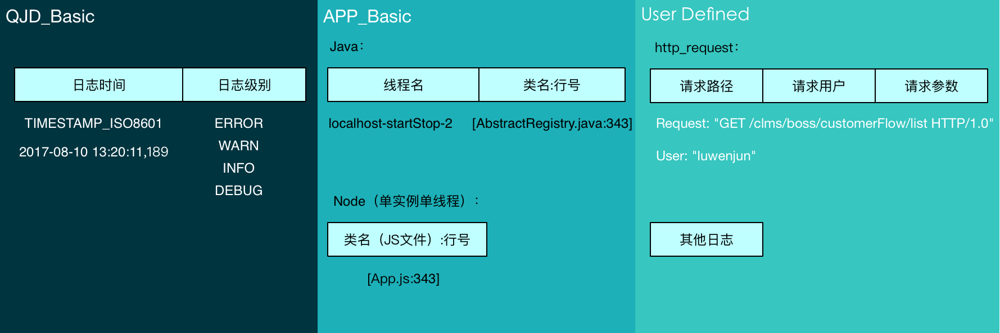

# 日志规范

为更好的进行日志分类、查询和分析。

### 格式构成



各Field间使用空格分割。

类名处使用中括号( [ ] )包裹，其后使用空格+中划线+空格( - )，以示区分基础信息和具体日志信息。

在自定义消息区，消息定义参考上图所示，包括保留字段Request、User以及其后的冒号( : )与空格( space )，建议不同信息块之间使用逗号( , )分割。

示例：

```
2017-08-10T10:07:28,413 INFO localhost-startStop-2 [AbstractRegistry.java:343] - Request: "GET /clms/boss/customerFlow/list HTTP/1.0", User: "luwenjun", Args: {}, some messages.
```

### 日志级别

以下是基于StackOverflow上的一个[讨论帖](https://stackoverflow.com/questions/2031163/when-to-use-the-different-log-levels)，总结的部分观点，供参考：

##### FATAL

致命，表示需要立即进行处理的错误。表示系统已经出现一定程度的不可用，是最严重的日志级别，但是也必须要慎用，如果频繁的出现也就意味着该级别失去了该有的警示作用。

一般情况下，在一个进程生命周期内，在发生无法恢复的错误导致进程退出时，使用一次即可。

##### ERROR

该级别的日志，表示系统也已经进入不可用的状态，较FATAL稍低，但是对于用户的感知已经一样，也需要管理员马上进行处理。

打个比喻，FATAL是已经挂了，ERROR没有挂，但是已经不能正常提供服务。

特别值得一提的是，FATAL和ERROR都是系统级别的错误，是服务器自己的异常，是需要人工介入解决的，对于用户操作不当，例如输入参数错误等， 万不能记入ERROR日志。

##### WARN

该日志表示系统可能有异常，也有可能没有，比如网络的波动等。一般表示，当前还不是ERROR，但是如果不及时处理，就会演变成ERROR的情况，比如一些阈值，内存、磁盘超过一定使用量等。

还有一些，比如没有找到配置文件，但是系统内部有容错机制，使用了默认配置，也应该提醒，因为可能造成逻辑上的不正确。

该级别的日志也应该适当使用，不可滥用。

##### INFO

该日志以记录系统的正常运行状态，比如某个子系统加载完成，某个请求正确响应等。

需要考虑在发生FATAL/ERROR/WARN错误时，可以快速知道哪些过程已经正常结束，以助定位，并且可以适当的添加一些关键信息，比如ID。

通常情况下，INFO日志不应超过DEBUG日志的10%。

##### DEBUG or TRACE

该日志的主要作用是精确的记录系统每一步的运行状态，可以精确的查看是什么操作，何种参数，何种顺序，为问题诊断而生。

值得注意的是，DEBUG日志也需遵循一定的规范，便于测试人员和运维人员也能查看和诊断。


