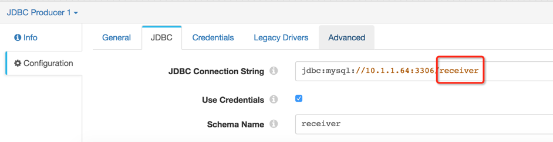

# StreamSets

文档参考：

https://streamsets.com/documentation/datacollector/latest/help/

## Run Via Docker

```shell
docker run --restart on-failure -p 18630:18630 -d --name streamsets-dc streamsets/datacollector
```

## Install JDBC Driver

- Package Manager
  - All Stage Libraries > JDBC | MySql BinLog | RabbitMQ 3.5.6 | MongoDB 3.0.2 | Redis 2.8.x, 3.0.x
  - External Libraries > mysql-connector-java-5.1.43.jar ( for streamsets-datacollector-mysql-binlog-lib )

## JDBC Producer

database name不要忘记：

