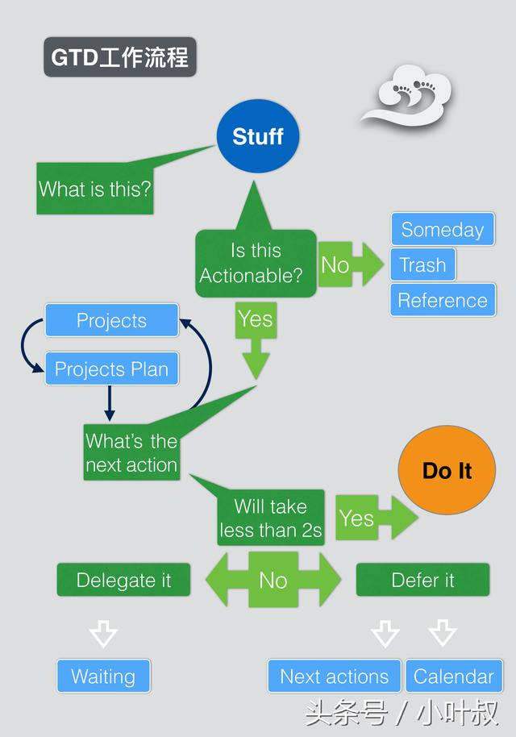
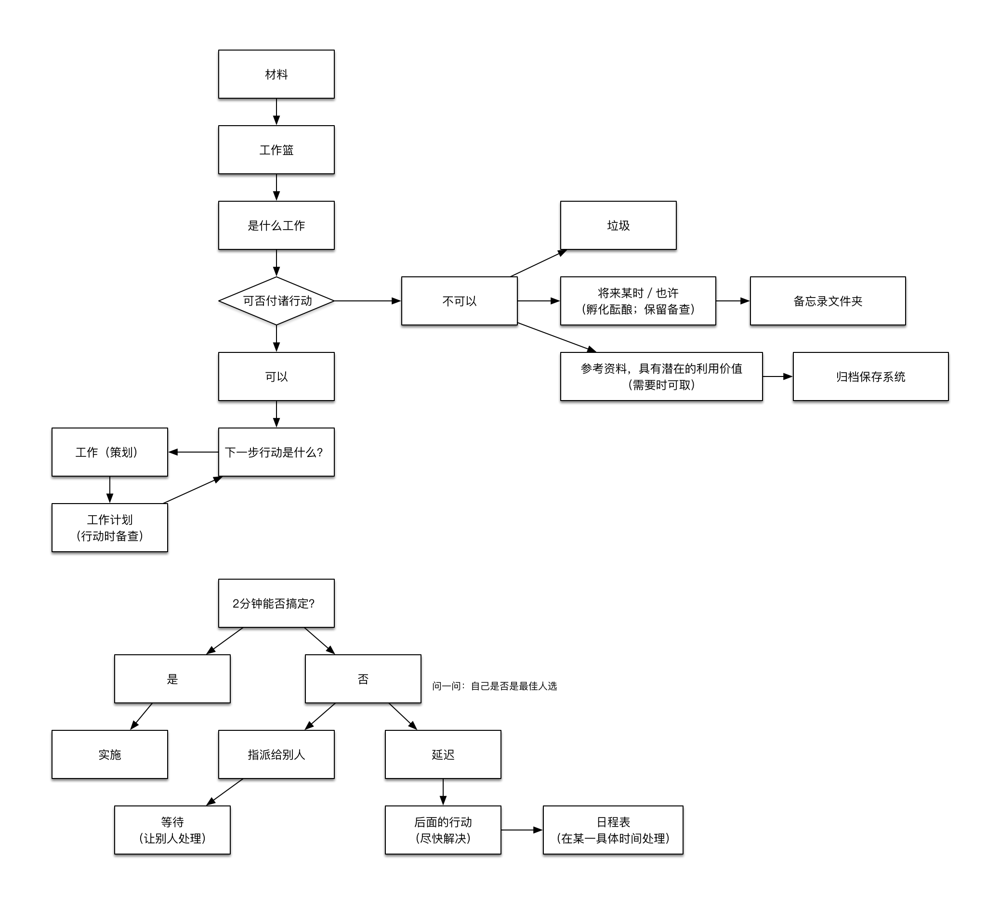

# GDT学习笔记

GTD的五个核心原则是：收集、整理、组织、回顾、执行。

## 横向管理工作进程的5个阶段

1. 收集一切引起我们注意力的事情
2. 加工处理后，确定它们的实质以及解决方法
3. 组织整理得出的结论
4. 把它们列为我们行动的选择方案
5. 行动

### 收集

### 加工处理

### 组织管理

### 回顾

一旦完成了工作日历中的某一项工作(一个会议，一个电话和报告的定稿)，接下来立即投入检查那些未尽的事宜将是一个极好的习惯。

每周查阅

### 行动

##### 在某一时刻，决策行动的 4 个标准的模式

1. 环境

   有一些事情对地点没有什么特别的要求(像拿一支钢笔和一张纸就可起草有关一 项工程的想法)。但是，大多数事情的处理需要某一个明确的地点(在家或办公室) 或者要求某些辅助设备，如一部电话机、一台电脑。而这些因素首先限制了目前可能 作出的选择。

2. 有多少时间

   在什么时候你必须去处理其他的事情呢?如果 5 分钟后你就必须去开会，你现在 就不可能去解决许许多多耗时持久的事情。

3. 有多少精力

   你有多少精力呢?某些事情需要你精力旺盛、标新立异、富于创造力;而另一些 则要求更加充沛的体力;还有一些事情对两者都无过分的苛求。

4. 重要性

##### 评估每日工作的 3 种模式

- 处理事先安排好的工作

- 处理随时冒出来的事件

- 定义你自己的工作

  清空工作篮，分解工作等

##### 回顾和检查工作 6 个标准的模式

- 5 万英尺以上:生活

  生活这就是我们整个生活的全景。你的公司为什么会存在呢?你自己为什么会存 在?任何事物的主要目标为我们提供了定义其性质的核心手段。这是对工作的最终描 述，你制定的所有目标、前景展望、规划、任务及行动都来自于这个工作描述，同时 也为其获得成功指明方向。

- 4 万英尺:3~5 年的展望

  3~5 年的展望展望未来 3~5 年的发展前景，你必定会从一个更加广阔的角度着眼: 管理策略、周边环境发展的趋势、事业和生活转变的条件。

  内在的因素包括事业、家庭和财政方面的长期目标，外部世界的发展变化，包括技术进步、全球化进程、市场 趋势及竞争等，势必影响到你的工作和组织管理方法。在这一层次的决策将会轻而易 举地改变你其他各个阶段的工作内容。

- 3 万英尺:1~2 年的目标

  1~2 年的目标从现在起 1~2 年内，你希望在生活和工作的各个领域达到哪些目标， 这为你定义工作又创造了一个崭新的领域。随着一些新的责任和义务的产生，你需要经常调整自己的工作重心，以完成所制定的目标。

  在个人生活的领域中，情况也大同 小异，你希望使某些事情尽快到位，这将增强你生活中某些方面的重要性，同时弱化另一些方面的问题。

- 2 万英尺:责任范围

  责任范围自身承担的种种责任和义务，致使你承受了先前的大部分工作。对于大 多数人而言，这些工作可以划分为 10~15 个范畴。在这些重点领域里，你希望取得成 果或者保持现有的水准。你的工作性质也许涉及到某些责任，如战略计划、行政支持、 员工培训、市场调研、客户服务或者资产管理。

  此外，你还需要关注个人生活中众多具有重要意义的方面:健康、家庭、财政收支、住 宅环境、宗教信仰、娱乐休闲等。把所有这些责任和义务一并诉诸文字，并经常回顾 和自检，这将有助于你更加综合全面地对自己的任务清单进行分析和评估。

- 1 万英尺:当前的工作

  当前的工作目前你手中有 30~100 项工作亟待处理，这些都是你希望在相当短的 时间内取得成效的事情。例如，在家里添置一台电脑，组织开一次销售会议，把公司 总部迁往新址，去看牙医等。

- 跑道:目前的行动

  目前的行动这是一份写得密密麻麻的工作清单，记录了你需要处理的一切事务: 所有你需要打的电话，所有等待回复的电子邮件，所有要跑腿处理的事情，还有你打 算向老板汇报的日程安排，以及希望同配偶交流的信息。即使你现在能够停止地球的 运转，不再从你自己或其他人那里接收更多的信息，你大概也要忙碌 300~500 小时， 才能把手头的事情一一解决。

让我们由下至上入手。

## 纵向管理:巧妙制定工作计划

### 强化“纵向”工作重心

人们计划做得越多，形式越随意自然，他 们获得的效果就越理想，同时，还释放了大量的精神压力。

### 自然式计划模式

世界上经验最丰富的计划家就是你的大脑。人的大脑只有经过 5 个步骤才能够完成任何一项任务:

1. 定义目标和原则
2. 展望成果
3. 集思广益
4. 组织管理
5. 明确下一步的行动方案

### 非自然式计划模式

#### 当“好主意”变成了一个坏主意时

你是否听说过，一位经理在一次会议上满怀善意地发问道:“那么，谁能够想一 个好办法解决这个问题呢?”这个假设是什么?在我们考虑对“好主意”的评估标准是否可以完全信赖之前，首先，我们必须明确这个提议的目的，清楚地勾勒出前景的轮廓，并收集(集思广益) 和分析(组织管理)所有的相关资料。

“什么是一个好主意呢?”本身就是一个绝妙 的问题，但是，这是以你思考的程度达到 80%时为前提的!而一开始就提出这个问题， 很可能会扼杀任何人的创造力。

`如果你在产生任何想法之前，一直等待着冒出一个好主意来，那么，你就不会拥有许多想法了。`

如果当你试图处理某一情况时，并不遵循大脑运作的自然规律，问题就不那么容 易解决了。人们总是一直忙碌于处理各种各样的问题，但总是造成混乱不清、压力平 添的局面。在与他人交流时，这往往导致为自负、偏见大开方便之门，使其最终取代 了友好的讨论。如果你打算在定义目标、展望前景、网罗愚蠢想法之前就梦想得到一 个“好主意”的话，那么，这往往只会阻碍你启动创造性的思维。

### 反应式计划模式

> 当你发现自己身陷一个黑洞时，立刻停手，不要再继续挖了。——威尔·罗杰斯(Will·Rogers)

### 自然式计划法的技巧:5 个阶段

#### 目的

问一问“为什么”这个问题你永远都不会受到任何损失的。

如果你目前从事的所 有事情在初始阶段都经过了细致周密的安排，那么它们都有机会进一步改进，甚至获得某种激励。

你为什么打算参加下一次会议呢?你工作的中心意图是什么呢?你为什 么请朋友们在你家的后院里烧烤聚餐呢?你为什么雇佣了一位市场营销经理呢?你 为什么设立自己的预算呢?

`当你已经忘却了自己的目标，却还一再加倍付出，这就叫做狂热。`

##### 思考“为什么”这个问题的价值

下面仅仅是思考这个问题的某些好处:

- 界定成功

  目标界定了成功，这是你决定投入多少时间 和精力时的一个最为重要的参照点

- 创造了决策标准

  `通常，作出一个艰难决策的惟一途径就是，回到目的上来。`

- 集结资源

- 激发动机

- 阐明重点

- 拓宽选择

#### 原则

> 简单清楚的目标和原则可以激发复杂而机智的行动。复杂烦琐的规则和条例将导致简单而愚昧的行动。
>
>  ——迪伊 ·霍克 ( Dee·Hock)

如果别人的行为超越了你设立的标准，或者容忍这样的行为存在，那么，这就是 产生重重压力的一个主要原因了。

#### 聚焦的力量

#### 阐明结果

#### 集思广益

#### 开动脑筋的关键技巧

有许多技巧都可以用来启动思维，强化打破常规的思考模式。这些基本原则可以 归纳为以下 3 点: 

- 不判断，不质疑，不评估，不批判。
-  追求数量，不求质量。
- 把分析组织工作置于次要的位置上。

#### 组织协调

一旦你把头脑中的一切想 法清除出去，一目了然地全部摆在你面前，你将自然而然地发现它们之间存在的联系 和结构。

#### 你到底需要制定多少计划呢?

**80%**：仅仅需要我们开列出一个清单，概括出预期的效果以及各阶段的行动步 骤，就足以解放我们的头脑了。

**15%**：至少要求辅助性地运用某一种外在的集思广益的模式，也许是心智计划法，或者采用某种文字处理软件来记录一些信息。 

这些对于应付一个会议的日程安排、一次外出度假计划，或者为参加商务会议准备一个发言稿来说，简直是绰绰有余了。

**最后的5%**：你必须认真权衡，仔细考虑，审慎地实施自然式 计划法中的 5 个阶段，至少是 1 个阶段。

这种计划模式帮助我们对各项工作加以分割， 它为彻底根除问题和推动工作发展提供了一个具有实用价值的指导。

在通常情况下，采用这种计划模式往往是在工作上获得显著进展的关键性因素。

## 确定时间、空间和工具

##### 确定时间

专门空出两天时间来处理这个过程，对于你的工作效率和精神健康而言，都将具 有成倍的价值。

##### 确定空间

你必须准备一个专门的工作空间——在家、在工作场所，如果可能的话，甚至在旅途中。

拥有自己的工作空间是十分重要的。你希望动用自己的系统，而不仅仅是在头脑 中考虑它们。

##### 一些基本的管理工具

- 资料存放筐(最少 3 个)
- 一叠信纸大小的白纸
- 即时贴(3×3 寸)
- 回形针
- 订书机等
- 透明胶带
- 橡皮筋
- 自动打孔机
- 若干文件夹
- 一个日程表
- 废纸篓
- 资料存放筐

##### 个人整理日

## 收集阶段:填充工作篮

## 处理阶段:清空工作篮

当你完成了加工处理工作篮的活动时，你将:

1. 丢弃你不再需要的一切;
2. 完成任何用不了 2 分钟就能搞定的事情;
3. 把任何可以委托他人处理的事情交代出去;
4. 为所有需要走过 2 分钟时间的工作注明提示信息，并分类纳入你的管理系统之中;
5. 根据获取的信息，明确你目前一些较为重要的工作和任务。

> 把context分成三類：地點、工具、人物。
>
> - 地點－該動作只能在特定地方執行。如到ATM領錢，context可設成ATM。
> - 工具－只有該工具協助下才能執行動作。如打電話給朋友，只要有電話就可以打，context可設為電話。
> - 人物－分配任務給該人或與該人有沒討論完的議題。
>
> 總結一下，context的設置需要與該動作的惟一性有關聯。如題主的狀況，讀書不一定需在圖書館讀，也可以家裡讀。所以讀書在地點的選擇沒有惟一性，但在工具上有惟一性，即書本－讀書需要有書本才能讀。
>
> 分享一下自己的小技巧，本人經常需在家裡的電腦前做事，但有時不想做事就會形成拖延。所以我會在「電腦」這個context下新增兩個子context, 分別是感覺身體很有衝勁時的「高能量」和感覺心情低落，不想做事時的「低能量」。

### 加工处理的方法指导

学习这种模式的最佳途径就是行动起来。但是，还是有几个基本原则可以遵循:

1. 从最上面的一项开始处理。

   即使第二项事情是你们国家总统先生给你的一封个人留言，而第一项仅仅是一个 垃圾邮件，你也必须首先对付这个垃圾邮件。虽然这是一个夸张的例子。但是这个原 则是非常重要的，每一件事情都必须获得均等机会的处理。“处理”这个动词并不意 味着“花费时间”，它仅仅是指“判断事情的实质，决定下一步的行动方案，然后相 应地处理掉”。无论如何，你必须尽最大的可能迅速地突击到工作篮的底部，而且不 逃避任何一件事情的处理。

   > 工作篮是一个处理问题的站点，而不是一个存储容器。

2. 一次只处理一件事情。

3. 永远不要把任何事情再次放回工作篮

   > 加工处理的关键性问题:“下一步行动是什么?”

   > 就像是一只在一个挤满了裸体的账篷中的蚊子，我清楚自己想要做什么，但是却不知道从哪里下手。
   >
   > ——斯蒂芬贝恩

## 管理阶段:建立好清单

必须对这些事物类型分门别类地加以保存，无论是在视觉上、具体形式上，还是`心理上`。