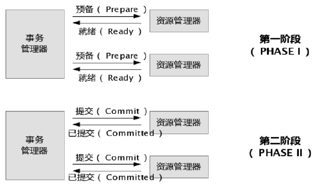

# Java

Java面试相关准备及总结。

## 代码规范

### 面试要点

- 字迹工整，书写清楚

- 合理的布局，清晰的缩进

- 合理的命名，见名知义

- 代码完整

### 面试题目参考

- [二分查找](http://blog.csdn.net/q3498233/article/details/4419285)
- [排序](http://blog.csdn.net/davebobo/article/details/51170177)
- 多线程和控制（暂停，恢复，停止）
- 生产者消费者
- 已知用户、角色、权限，判断权限
- [其他](http://blog.csdn.net/qq_17612199/article/details/52606209)


### 源代码展示

- github


- 自带


- 手写，提示面试要点在规范及思维过程

## 逻辑思维

### 授信额度的使用

1. 题目：

   公司A给予授信额度若干，放款时会使用授信额度，还款时会释放授信额度，描述大致实现。

2. 要点：

   正确的逻辑；

   并发时的处理。

3. 额外加分：

   冻结逻辑

### 合同模版的设计

1. 题目：

   如何通过模版的管理，规范合同生成的过程，描述大致解决方案。

2. 要点：

   正确的逻辑；

   空怎么填；

   要素怎么保存。

3. 额外加分：

   字典逻辑

## Java相关

### Java基础

#### 语法

JDK、JRE的区别

重载和重写的区别

java、javac分别做什么？

变量的作用域和生命周期

#### 堆栈

##### Java虚拟机栈（Java Virtual Machine Stacks）

虚拟机栈描述的是Java方法执行的内存模型：每个方法被执行的时候都会同时创建一个栈帧（Stack Frame）用于存储局部变量表、操作栈、动态链接、方法出口等信息。每一个方法被调用直至执行完成的过程，就对应着一个栈帧在虚拟机栈中从入栈到出栈的过程。

##### 本地方法栈

与虚拟机栈类似，为Native方法服务。

##### Java堆

Java堆是被所有线程共享的一块内存区域，在虚拟机启动时创建。

此内存区域的唯一目的就是存放对象实例。

Java堆是垃圾收集器管理的主要区域，因此很多时候也被称做"GC堆"。

通过-Xmx和-Xms控制。

##### 方法区（Method Area）

与Java堆一样，是各个线程共享的内存区域，它用于存储已被虚拟机加载的类信息、常量、静态变量、即时编译器编译后的代码等数据。

虽然Java虚拟机规范把方法区描述为堆的一个逻辑部分，但是它却有一个别名叫做Non-Heap（非堆），目的应该是与Java堆区分开来。

#### 面向对象

##### 匿名对象

什么是匿名对象，什么时候使用？

##### 构造代码块

```java
public class Demo {
  static {
    System.out.println("这是静态代码块");
  }
  {
    System.out.println("这是构造代码块");
  }
  public Demo() {
    System.out.println("这是一个无参数构造方法");
  }
}
```

执行顺序：静态代码块>main方法>构造代码块>构造方法。

静态代码块只执行一次，比如在调用C语言动态库的代码可以放在此处。

构造代码块可以放一些不同构造方法间有共性的部分代码，不常使用。

##### 创建对象的过程

如下，创建对象时，在内存中做了什么事情？

```java
Person p = new Person();
```

1：先将硬盘上指定位置的Person.class文件加载进内存。

2：执行main方法时，在栈内存中开辟了main方法的空间(压栈-进栈)，然后在main方法的栈区分配了一个变量p。

3：在堆内存中开辟一个实体空间，分配了一个内存首地址值。

4：在该实体空间中进行属性的空间分配，并进行了默认初始化。

5：对空间中的属性进行显示初始化。

6：进行实体的构造代码块初始化。

7：调用该实体对应的构造函数，进行构造函数初始化。

8：将首地址赋值给p ，p变量就引用了该实体。(指向了该对象)

##### 生成Java帮助文档

```shell
javadoc -d 文件夹名 -auther -version *.java
```

##### 具体方法

下面这个方法的具体用途？

```java
int hashCode();
```

> 我们先通过 hashcode来判断两个类是否存放某个桶里，但这个桶里可能有很多类，那么我们就需要再通过 equals 来在这个桶里找到我们要的类。  
>
> 那么。重写了equals()，为什么还要重写hashCode()呢？  
>
> 想想，你要在一个桶里找东西，你必须先要找到这个桶啊，你不通过重写hashcode()来找到桶，光重写equals()有什么用啊！

##### 多线程

创建线程的方式：继承Thread、实现Runnable接口。

为什么要有Runnable接口的出现？

- 避免单继承的局限性
- 业务分离

##### 同步

如何定位死锁？


wait和sleep的区别：

wait：线程会释放执行权，而且线程会释放锁。

sleep：线程会释放执行权，但不是不释放锁。


解释join方法。


Lock与同步的异同？

1. lock是一个接口，而synchronized是java的一个关键字，synchronized是内置的语言实现；（具体实现上的区别在《Java虚拟机》中有讲解底层的CAS不同，以前有读过现在又遗忘了。） 
2. synchronized在发生异常时候会自动释放占有的锁，因此不会出现死锁；而lock发生异常时候，不会主动释放占有的锁，必须手动unlock来释放锁，可能引起死锁的发生。（所以最好将同步代码块用try catch包起来，finally中写入unlock，避免死锁的发生。） 
3. lock等待锁过程中可以用interrupt来终端等待，而synchronized只能等待锁的释放，不能响应中断； 
4. lock可以通过trylock来知道有没有获取锁，而synchronized不能； 
5. Lock可以提高多个线程进行读操作的效率。（可以通过readwritelock实现读写分离）


##### 集合

**可变长度数组的原理：**

当元素超出数组长度，会产生一个新数组，将原数组的数据复制到新数组中，再将新的元素添加到新数组中。

ArrayList：是按照原数组的50%延长。构造一个初始容量为 10 的空列表。

Vector：是按照原数组的100%延长。

**HashSet集合保证元素唯一性：**

先判断hashCode，再判断equals。

**将非同步集合转成同步集合的方法：**

Collections中的 XXX synchronizedXXX(XXX)

例：

```java
List list = Collections.synchronizedList(new ArrayList());
Map<String,String> synmap = Collections.synchronizedMap(map);
```

原理：定义一个类，将集合所有的方法加同一把锁后返回。

#### java.concurrent

CountDownLatch:

并发构造，允许一个或多个线程等待一系列指定操作的完成。

CyclicBarrier:

实现线程同步，是一个所有线程必须等待的一个栅栏，直到所有线程都到达这里，然后所有线程才可以继续做其他事情。

#### NIO

NIO与IO的主要区别。

| IO   | NIO   |
| ---- | ----- |
| 面向流  | 面向缓冲  |
| 阻塞IO | 非阻塞IO |
| 无    | 选择器   |


几个核心部分。

- Channels
- Buffers
  - flip
  - capacity
  - position
  - limit
  - clean
  - compact
- Selectors


#### Git相关


### Spring基础

#### Java反射知识

简单描述

包含哪些反射对象：Constructor、Method、Field

如何访问private、protected成员变量和方法：setAccessible(boolean access)


#### Java动态代理／AOP

两种代理机制

- 基于JDK


- 基于CGLib

两种代理机制的差别

- JDK只代理接口


- CGLib性能高


- JDK创建对象开销小


- CGLib通过创建子类代理，所以无法代理final方法

#### XML配置基础

简述Schema命名空间的定义结构

指定Schema命名空间的两个用途

- 格式合法性验证


- IDE代码提示

#### ThreadLocal

简述工作原理

- 副本


- 使用Map，Key为线程对象，值为变量副本

简述与Thread同步机制相比，解决并发问题时的不同

#### 数据库事务

数据库事务的4 个特性

- 原子性（Atomic）


- 一致性（Consistency）


- 隔离性（Isolation）：多种事务隔离级别，隔离级别越高，数据一致性越好，并发性越弱


- 持久性（Durabiliy）：持久化

#### 数据并发问题

##### 脏读（dirty read）

| 时间   | 转账事务A           | 取款事务B           |
| ---- | --------------- | --------------- |
| T1   |                 | 开始事务            |
| T2   | 开始事务            |                 |
| T3   |                 | 查询账户余额为1000元    |
| T4   |                 | 取出500元，改余额为500元 |
| T5   | 查询账户余额为500元（脏读） |                 |
| T6   |                 | 撤销事务余额恢复为1000元  |
| T7   | 汇入100元，改余额为600元 |                 |
| T8   | 提交事务            |                 |

> 一个有结巴的人在饮料店柜台前转悠，老板很热情地迎上来说：“喝一瓶？”结巴连忙说：“我…喝…喝…”老板麻利地打开易拉罐递给结巴，结巴终于憋出了他的那句话：“我…喝…喝…喝不起啊！”

##### 不可重复读（unrepeatable read）

| 时间   | 取款事务A                | 转账事务B           |
| ---- | -------------------- | --------------- |
| T1   |                      | 开始事务            |
| T2   | 开始事务                 |                 |
| T3   |                      | 查询余额为1000元      |
| T4   | 查询余额为1000元           |                 |
| T5   |                      | 取出100元，改余额为900元 |
| T6   |                      | 提交事务            |
| T7   | 查询余额为900元（与T4读取的不一致） |                 |

##### 幻读（phantom read）

| 时间   | 统计金额事务A          | 转账事务B       |
| ---- | ---------------- | ----------- |
| T1   |                  | 开始事务        |
| T2   | 开始事务             |             |
| T3   | 统计总存款为10000元     |             |
| T4   |                  | 新增账户，存款100元 |
| T5   |                  | 提交事务        |
| T6   | 再次统计，为10100元（幻读） |             |

幻读和不可重复读是两个容易混淆的概念，可重复读与不可重复读关注的在于某条数据，而幻读与否关注的是整个表之内的增删操作。

为防止幻读，往往需要添加表级锁，将整个表锁定。

##### 第一类丢失更新

| 时间   | 取款事务A            | 转账事务B          |
| ---- | ---------------- | -------------- |
| T1   | 开始事务             |                |
| T2   |                  | 开始事务           |
| T3   | 查询余额为1000元       |                |
| T4   |                  | 查询余额为1000元     |
| T5   |                  | 汇入100，计余额1100元 |
| T6   |                  | 提交事务           |
| T7   | 取出100，计余额为900元   |                |
| T8   | 撤销事务             |                |
| T9   | 余额恢复为1000元（丢失更新） |                |

##### 第二类丢失更新

| 时间   | 取款事务A           | 转账事务B         |
| ---- | --------------- | ------------- |
| T1   | 开始事务            |               |
| T2   |                 | 开始事务          |
| T3   | 查询余额为1000元      |               |
| T4   |                 | 查询余额为1000元    |
| T5   |                 | 取出100，计余额900元 |
| T6   |                 | 提交事务          |
| T7   | 汇入100           |               |
| T8   | 提交事务            |               |
| T9   | 余额计为1100元（丢失更新） |               |

##### 不同隔离级别的并发问题

| 隔离级别                   | 脏读   | 不可重复读 | 幻读   | 第一类  | 第二类  |
| ---------------------- | ---- | ----- | ---- | ---- | ---- |
| 未提交读（Read uncommitted） | Y    | Y     | Y    | N    | Y    |
| 已提交读（Read committed）   | N    | Y     | Y    | N    | Y    |
| 可重复读（Repeatable read）  | N    | N     | Y    | N    | N    |
| 可串行化（Serializable ）    | N    | N     | N    | N    | N    |

##### 数据库锁机制

大致有哪些锁？

锁之间的兼容性如何？

什么时候会发生死锁？如何解决？

#### HTTP报文

报文的大致组成

常用的报文头属性

常用的错误码

- 200 OK


- 303 See Other


- 304 Not Modified


- 404 Not Found


- 500 Internal Server Error


### Netty


### Redis


### 解决方案

- 两个事务同时进行转账，如何避免


- 分布式中的事务问题


- 信贷业务中，有授信额度，含公司编号，公司详细信息存储在另一个系统（客户管理系统），如果需要通过公司名称查询授信额度，数据库表怎么设计？


- 在分布式架构中，接口调用（涉及多个系统的多个接口交互）提示超时了，如何定位及处理？

  Nginx（或者其他负载）

  网络

  分布式跟踪系统

  尽量详尽的日志

  调优

  异步


### 数据库

Postgres-BDR

Postgres-XL

Apache Ignite

Database Replication

Real-Time Data Warehousing


## 架构设计基础

### 分布式架构

#### 分布式事务

CAP定律


在分布式系统中，同时满足“CAP定律”中的“一致性”、“可用性”和“分区容错性”三者是不可能的。

在互联网领域的绝大多数的场景，都需要牺牲强一致性来换取系统的高可用性，系统往往只需要保证“最终一致性”，只要这个最终时间是在用户可以接受的范围内即可。

##### 两阶段提交协议




##### 提供回滚接口

这种方式缺点比较多，通常在复杂场景下是不推荐使用的，除非是非常简单的场景，非常容易提供回滚，而且依赖的服务也非常少的情况。

这种实现方式会造成代码量庞大，耦合性高。而且非常有局限性，因为有很多的业务是无法很简单的实现回滚的，如果串行的服务很多，回滚的成本实在太高。

##### 本地消息表

举个经典的跨行转账的例子来描述。

第一步，伪代码如下：

```sql
Begin transaction
	update A set amount = amount - 10000 where user = 1;
	insert into message(user, amount, status) values (1, 10000, 1);
End transaction
commit;
```

第二步，通知对方银行账户加10000。

通常采用两种方式：

1. 采用时效性高的MQ，由对方订阅消息并监听，有消息时自动触发事件
2. 采用定时轮询扫描的方式，去检查消息表的数据。

两种方式其实各有利弊，仅仅依靠MQ，可能会出现通知失败的问题。

而过于频繁的定时轮询，效率也不是最佳的（90%是无用功）。所以，我们一般会把两种方式结合起来使用。

解决了通知的问题，又有新的问题了。万一这消息有重复被消费，往用户帐号上多加了钱，那岂不是后果很严重？

仔细思考，其实我们可以消息消费方，也通过一个“消费状态表”来记录消费状态。在执行“加款”操作之前，检测下该消息（提供标识）是否已经消费过，消费完成后，通过本地事务控制来更新这个“消费状态表”。这样子就避免重复消费的问题。

总结：上述的方式是一种非常经典的实现，基本避免了分布式事务，实现了“最终一致性”。但是，关系型数据库的吞吐量和性能方面存在瓶颈，频繁的读写消息会给数据库造成压力。所以，在真正的高并发场景下，该方案也会有瓶颈和限制的。

##### MQ（非事务消息）

依赖主流的MQ产品的持久化消息的功能。

如果消费者宕机或者消费失败，都可以执行重试机制的（有些MQ可以自定义重试次数）。

如何避免消息被重复消费造成的问题？

1. 保证消费者调用业务的服务接口的幂等性
2. 通过消费日志或者类似状态表来记录消费状态，便于判断（建议在业务上自行实现，而不依赖MQ产品提供该特性）

总结：这种方式比较常见，性能和吞吐量是优于使用关系型数据库消息表的方案。如果MQ自身和业务都具有高可用性，理论上是可以满足大部分的业务场景的。

##### MQ（事务消息）

> RocketMQ：
> [分布式开放消息系统(RocketMQ)的原理与实践](http://www.jianshu.com/p/453c6e7ff81c)

##### 其他补偿方式

做过支付宝交易接口的同学都知道，我们一般会在支付宝的回调页面和接口里，解密参数，然后调用系统中更新交易状态相关的服务，将订单更新为付款成功。同时，只有当我们回调页面中输出了success字样或者标识业务处理成功相应状态码时，支付宝才会停止回调请求。否则，支付宝会每间隔一段时间后，再向客户方发起回调请求，直到输出成功标识为止。

其实这就是一个很典型的补偿例子，跟一些MQ重试补偿机制很类似。

一般成熟的系统中，对于级别较高的服务和接口，整体的可用性通常都会很高。如果有些业务由于瞬时的网络故障或调用超时等问题，那么这种重试机制其实是非常有效的。

当然，考虑个比较极端的场景，假如系统自身有bug或者程序逻辑有问题，那么重试1W次那也是无济于事的。那岂不是就发生了“明明已经付款，却显示未付款不发货”类似的悲剧？

其实为了交易系统更可靠，我们一般会在类似交易这种高级别的服务代码中，加入详细日志记录的，一旦系统内部引发类似致命异常，会有邮件通知。同时，后台会有定时任务扫描和分析此类日志，检查出这种特殊的情况，会尝试通过程序来补偿并邮件通知相关人员。

在某些特殊的情况下，还会有“人工补偿”的，这也是最后一道屏障。

##### 互斥性和幂等性


#### 分布式日志

[Ignite+Lucene+Log4j](http://www.infoq.com/cn/articles/ignite-lucene-log4j2-log-query)

ELK日志采集方案

[logstash 和filebeat](https://www.zhihu.com/question/54058964)

#### 分布式存储

HDFS

GFS


## 操作系统及网络基础

### Linux

#### 基本命令

kill -3

#### Linux管道

将一个命令的标准输出作为另一个命令的标准输入。也就是把几个命令组合起来使用，后一个命令除以前一个命令的结果。

例：grep -r "close" /home/* | more       在home目录下所有文件中查找，包括close的文件，并分页输出。

#### 文件权限管理

三种基本权限

R           读           数值表示为4

W          写           数值表示为2

X           可执行    数值表示为1


### 网络

TCP和UDP