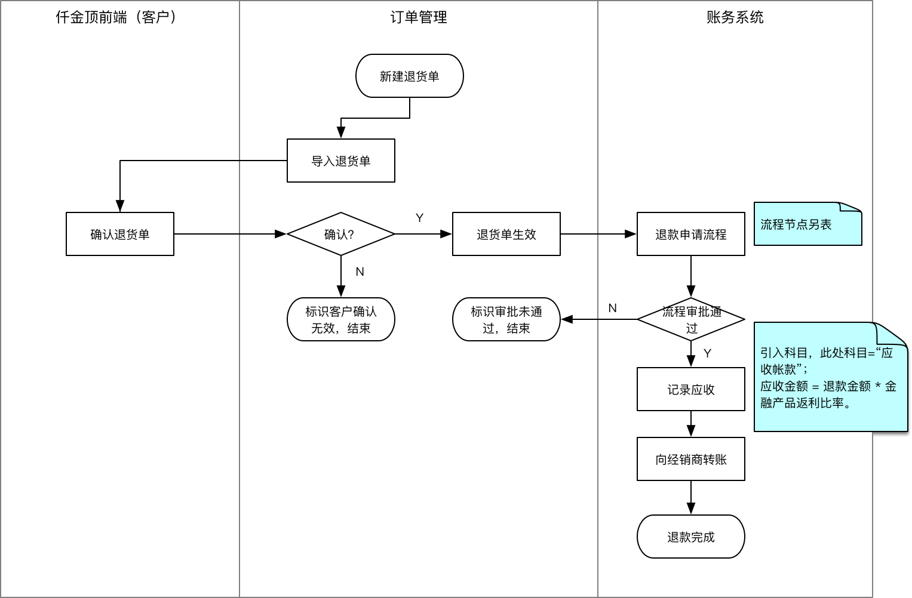
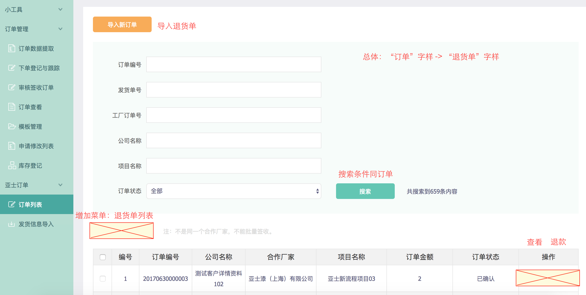

# 退货

## 概述

// 此处概述N字。

### 名词定义

// 略

### 业务流程

退货

## 功能描述

目前该功能仅正对亚士节能有效。

不支持零售。

不支持二级经销商。

### 退货

退货单生成逻辑同订货单（退货单模版参考[仟金顶退货模板](Returns-Attachment/仟金顶退货模板.xlsx)）。

将销售订单编号相同的数据，归为同一条退货单，物料编码往后，记入订单明细数据。

客户和项目按照名称匹配。

退货单状态：

- 已制单
- 已确认
- 已驳回
- 已退款

#### 页面说明

##### 导入退货单 & 退货单列表

##### 退货单详情页

同订单详情，去掉“已验证判断项”

##### 退货单确认页（客户端）

同订单确认

### 退款

1. 记录退款业务数据。

2. 记录账务数据，通过借贷记法，“应收账款 借 <<退款金额>>”，其中：

   退款金额 = 退货金额 - 返还返利金额

   返还返利金额 = 退货金额 * 返利比例

3. 从仟金顶现金账户转账到经销商现金账户，category = '退款'

#### 页面说明

参考Axure原型

### 付款

放款流程::出纳环节，显示应收总额及抵扣应收后，实际还需要支付的放款总额。

出纳点击放款后，优先将应收进行抵扣，在科目“应收账款”上记减少相应金额；其次同原有流程，进行账户间转账操作。

抵扣金额 = MIN(可抵扣金额, 付工厂金额)

实际付工厂金额 = 原付工厂金额 - 抵扣金额

记录“应收帐款 贷 <<抵扣金额>>”

#### 页面说明

参考Axure原型

### 遗留问题

对试算平衡的影响？

经销商取现问题：暂不考虑

## 对外接口

## 参考信息