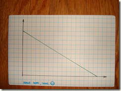
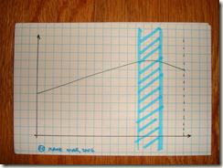
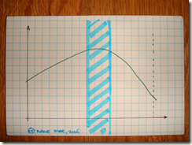
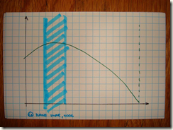
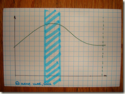
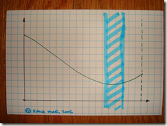
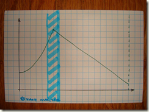

# 燃尽图

## 燃尽图的7个图形特征及说明的问题

参考：<http://www.bubuko.com/infodetail-1954923.html>

### Fakey-Fakey

特征是非常整齐，完全按照预定计划逼近迭代目标。

由于软件的复杂性，大多数时候我们都需要探索着完成目标。

在一个复杂的不断变化的领域仍然表现得规律并且在进度上完全符合预期，导致的通常都是假象。

Fakey-Fakey通常出现在"命令和控制"管理的团队中，在这种环境下，让团队普通成员发挥开放性思维和保持诚实会让他们感到难受。

### Late-Learner

在迭代快结束之前会有一个驼峰，通常是一些接受了敏捷开发思想，开始有效沟通和交流，并能够在迭代最终完成交付目标的新形成的团队。

在新团队中，这个驼峰出现的原因通常是因为大家在迭代的最后才意识到，要交付一个可演示的软件，测试是一个非常重要的部分。

### Middle-Learner

当团队开始变得成熟，会更注重迭代初期的探索，尤其是定义哪些地方需要测试，这样有助于把相当一部分工作移动到Sprint的中部，

如上图。

### Early-Learner

表现优异的敏捷团队通常会在初期有一个驼峰，然后逐渐燃尽。

这种情况下，团队已经了解到早期探索的重要性，也能及早定义出需要测试的地方。

一旦他们对完成的目标有了更具体更牢固的定义，他们就会持续稳定的朝着目标工作。

### Plateau

当团队从初期到成熟过度的过程中，通常会经历这样一个瓶颈阶段。

一开始团队有一个良好的进度，但是这个状态无法保持到Sprint结束。

燃尽图的特征是会逐渐进入平顶。

### Never-Never

有时候有一些一开始做得非常好的团队，到Sprint即将结束时会令人吃惊。

可能是因为团队太晚才寻求澄清需求，发现需求没对齐，或者是产品Owner希望调整Sprint的范围。

大量工作在Sprint尾声的突然增长会让团队难以兑现其承诺。

这些末期变更在迭代回顾时，需要重点拿出来讨论并解决。

### Scope Increase

该图的特征是预估剩余工作量的突然激增，通常是因为在Sprint planning会议上划定的工作范围团队成员并没有完全领会。

有几种办法来处理，一个比较推荐的办法是和产品owner谈判，但是如果团队完全无法理解需求范围的情况时，可以考虑终止该Sprint。