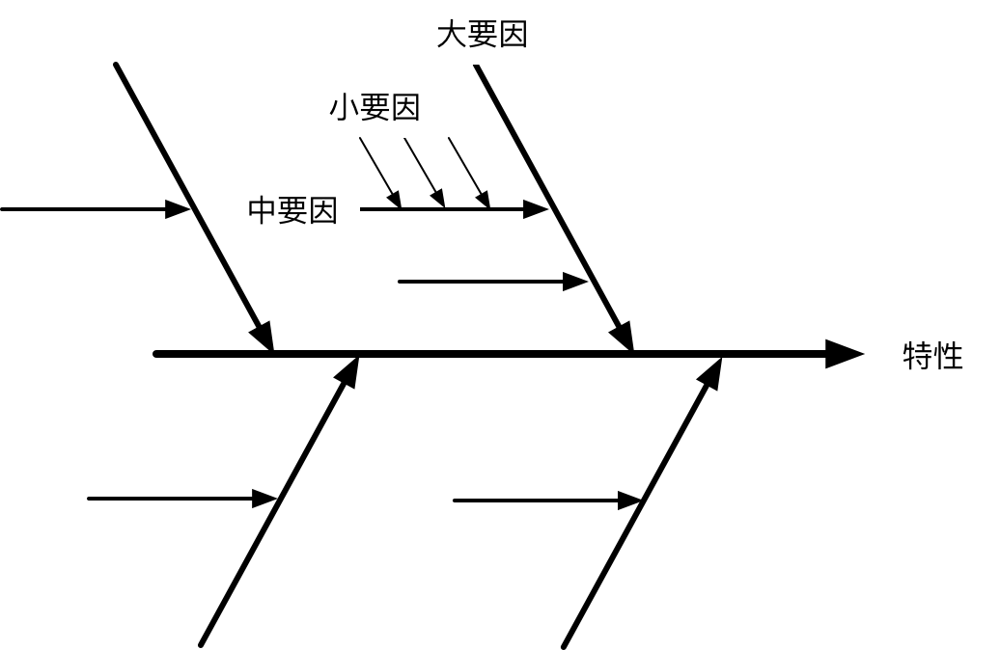
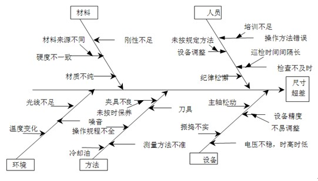

# 鱼骨图分析法

## 概述

也称作特性要因图，是指一个问题的特性在受到一些要因的影响时，

我们将这些要因加以整理，使之成为有相互关系而且有条理的图形。

**注意**：这里的特性是指一个可以量化的问题，感性的东西不适合用鱼骨图分析。

## 架构

一般，

1. 大要因由4～6根组成

	在制造业，通常是4M1E作为大要因(人、机器、物或材料、方法、环境)；

	对于软件工程，我们可以自己寻找一下。

2. 中要因和小要因由3～5根组成

## 方法

1. 发散思维

2. 是团体的事，不是一个人的事，要坚持以下原则

	- 禁止批评

	- 自由奔放

	- 越多越好

3. 最后从要因中找出可优化的点

## 示例

某厂家齿轮零配件尺寸变异

