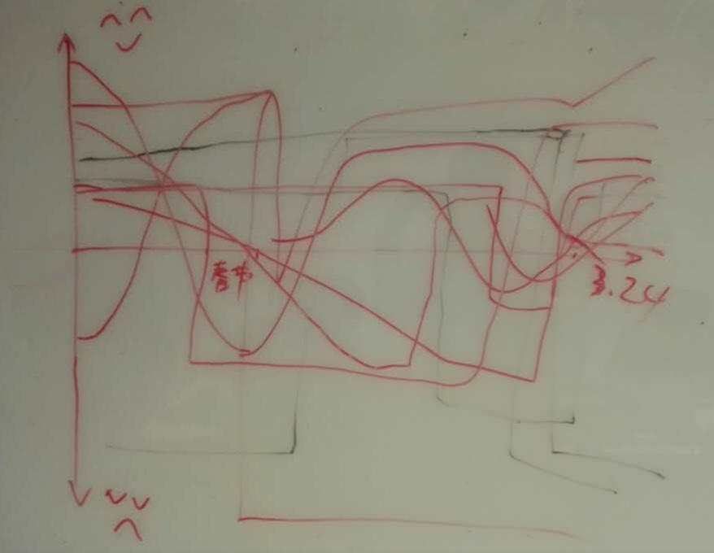

# 如何开好回顾会议

## 准备阶段

###	设定一个安全的环境

需要大家敞开心扉，绝对不要开成批判会议，不要去追究任何人的责任，避免讨论任何个人责任问题。

### 了解与会者的心态

ESVP

- Explorer （探索者）

	渴望发现新的想法和见解，希望学习一切关于项目、管理、迭代相关的知识。

- Shopper （推销者）

	希望得到有用的情报，一旦发现一个用户的想法或知识，便乐于高兴的回家了。

- Vacationer （度假者）

	并不是那么关心回顾会议，但是很高兴可以短暂的离开日常工作，休息一下。

- Prisoner （囚犯）

	感觉是被迫参加，还不如去做些其他事情，纯粹浪费时间。

不记名投票，希望唤起大家内心的思考。

### 激活大家的发言欲望

办法是一开始就破冰。

简单常用的方法是让大家按座位顺序轮流用一个词形容他对这个迭代的感受。

可能比较难，不过没关系，目的是让大家把转起来。

这样不仅把大家带到了回顾的思路里，更重要的是大家一开始就有机会开口表达自己的想法了。

### 把大家带到这个迭代历史的回忆中来

有一个有意识的实验叫**心情曲线**。

如图是一个团队真实的曲线结果，每个人都不一样，分享这个曲线的过程甚至能加强团队成员的相互了解，加强信任感。

### 介绍会议的基本规则

1. 团队的基本会议规则，常见的是不使用电脑、不打电话等

2. 介绍本次会议时长和大致流程安排

## 收集数据

ideaboardz

### 产生见解

邀请成员一起分类，再邀请一位成员宣读。

对于好的，一定要坚持，讨论是否需要记入团队契约。

对于不好的，只挑优先级最高的3个。（ideaboardz支持投票）

### 确定改进项

先分析问题的根源。

最常见的方法有鱼骨图法和5W法。

5W2H：

- Why

- What

- Who

- When

- Where

- How

- How Much（多少）

### 分组讨论

寻找问题的根源往往非常费时，可以分组进行，每个小组讨论其中一个问题。

可以限时找出问题的根源和建议改进计划，这样可以节约时间，也可以调动每个成员的参与度。

### SMART改进计划

- 具体的（Specific）

- 可以衡量的（Measurable）

- 可以达到的（Attainable）

- 可以证明和观察(Realistic)

- 截止期限（Time-bound）

大家非常容易产出一些类似`建议`一样的东西，完全没办法执行，这个要避免。

虽然说起来容易，做起来却非常困难，但是还是要努力。

### 避免产生过多改进计划

就算有很多，也要拍好优先级，要结合产品Backlog，否则无法落实。

## 结束会议

做个总结建议，可以帮助我们提高下次回顾会议的组织能力。

或者通过一张纸条，感谢团队里的成员，可以很好的激励团队更好的合作和相互帮助。

感谢卡：

在xxx这段时间里，我非常感谢xxx，因为xxxxx。

署名：xxx

## 需要注意的地方

- 一般不建议经理参加，这有悖于准备环节中提到的“设立一个安全的环境”。

	特例：团队已经积累了非常严重的问题，但是经理可能不了解情况，团队迫切希望经理了解到并推动事情的改进。

- 形成有效的跟踪

	通常建议维护到产品Backlog列表中，作为技术Story，在下个迭代进行解决。

- 前后回顾会议产生相同或类似的改进计划

	说明老问题一直都没有得到解决。

	一般如果想“改进能力”或者是“外部依赖”的问题，往往会造成这样的结果，这些不像团队改进流程那样立竿见影，

	对于这样的问题，最好能计划长期的改进计划（周期迭代），下次回顾会议可以监控进展，而避免重复问题。

- 回顾会上最好过一下上次回顾会的改进事项

## 参考

[敏捷回顾:团队从优秀到卓越之道](https://issuu.com/xiuxiuebook/docs/____________________________________97f94544aa61fc)