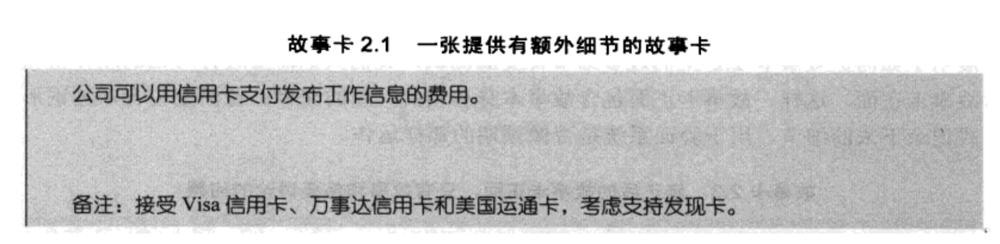
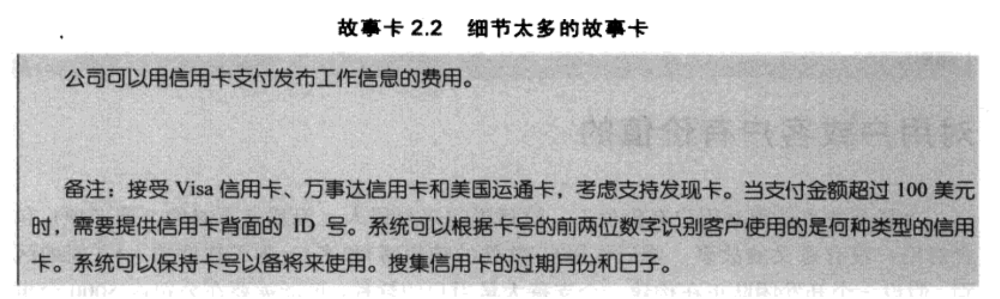
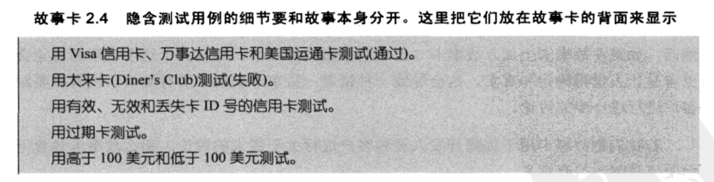

# Story

## 概念

User Story是敏捷开发的基础，它不同于传统的瀑布式开发方式，而是把原本需求拆成最小粒度的Story，以方便拆分Task，估计开发时间，领取开发任务。

User Story是从用户的角度对系统的某个功能模块所作的简短描述。

一个 User Story 描述了项目中的一个小功能，以及这个功能完成之后将会产生什么效果，或者说能为客户创造什么价值。

User Story是敏捷开发和管理的核心，要确保Story的输出质量。

## 编写Story

关注六个特征（INVEST）。

### 独立性（Independent）

一定要保证Story在功能上的独立，尽量不要有Story之间的依赖，否则会大大影响将来的开发和测试。

#### Story间的依赖会使得做估计变得更加困难

比如，我们正在开发BigMoneyJobs，现在需要编写付费发布职位的Story，开始可能是这样的：

1. 公司可以使用Visa信用卡对发布的职位进行付费

2. 公司可以使用Mastercard信用卡对发布的职位进行付费

3. 公司可以使用AMEX信用卡对发布的职位进行付费

假设开发人员对于支持第一种信用卡（不管是哪个）需要 3 天时间，然后支持第二种和第三种各需要 1 天。

对于这些相互依赖的Story，就不知道怎么给每个Story估计多少时间 -- 哪个Story需要 3 天呢？

出现这种依赖时，有两种方法。

- 将相互依赖的故事合并成一个大的、独立的Story

- 用一个不同的方法去分割Story

在这个案例中，合并是可行的，合并成`公司可以使用信用卡对发布的职位进行付费`后，Story仅需要 5 天时间实现。

如果远大于 5 天，最好找一个不同维度来分割Story。

- 客户可以用一种信用卡支付

- 客户可以使用另外两种信用卡支付

如果你不想合并，又找不到很好的方法分割，就可以给Story两个估计，当早于某一个Story时，是一个估计，当晚于那个Story时，是另一个估计。

### 可谈判性（Negotiable）

也叫`可讨论的`。

好的Story Card：

细节太多的故事卡：

细节通过测试用例表达：

Scrum中的story不是瀑布开始某事中的Contract, Stories不必太过详细，开发人员可以给出适当的建议。

### 有价值性（Valuable）

Story需要体现出对于用户的价值。

保证Story对客户或者用户有价值的最好办法是由客户来编写故事。

Story Card只是用来提醒他们需要之后对需求进行讨论，而不是一个正式的承诺或某个功能的具体描述。

大多数用户一旦接受这个概念，就会自己写故事了。

### 可估计性（Estimable）

Story应可以估计出Task的开发时间。

不可估计的可能原因：

1. 开发人员缺少领域知识

	他们应该和写故事的客户一起讨论，同样，不需要理解故事的所有细节，但要有大概的了解。

2. 开发人员缺少技术知识

	可以尝试极限编程（XP）中的探针试验（Spike），这样，一个不可估计的Story就变成了两个：一个探针试验，和一个真正的Story。

	如果有可能，较好的做法是把探针试验放在一轮迭代中，而把真正的故事放在下一轮迭代，如果放在同一个迭代，不确定性会高于平常，因为我们还不知道真正的Story会花费多少时间。

3. 故事太大了

### 大小合适（Sized Right）

关于Story的粒度，建议的开发工作量是3-5天（包含针对Story所做的开发者自测工作量），如果Story不能拆分到3-5天的开发粒度，则一定要确保该Story在一个迭代周期内可开发测试完成。

#### 分割

Epic Story 通常分为：

- 复合（Compound Story）

- 复杂（Complex Story）

#### 合并

### 可测试性（Testable）

要从可测试性考虑需求，同时要考虑能够独立测试，每个任务都应有Junit Test。

另外注意，伴随Story要同时输出可接受性测试用例（Acceptance Test Case，以下简称AT），用于验证Story是否开发完成，可以给测试人员做Story测试。

AT用例在Story协作阶段只是对测试要点、场景的描述，在迭代开发阶段可以继续补充和完善。

不可测试的Story一般发生在一些非功能性的需求上，比如：

- 用户必须觉得软件很好用

- 用户绝不需要花很长的时间等待页面出现

上述Story不可测，是因为用了“绝不”，而且没有明确定义“长时间等待”，

可以改写为“在95%的情况下，用户可以在2秒内打开页面。”

这个Story是可测的，但是通常需要观察大量的随机用户，耗时且昂贵。

无论什么时候，只要可能，我们就要把测试自动化，要争取99%，而不是10%。

### 问题

##### 下面Story中，哪些好，哪些不好，说出理由。

1. 用户能够快速掌握系统

2. 用户可以修改简历上的地址

3. 用户可以增加、修改和删除多份简历

4. 系统可以计算n元二次型方程分布的鞍点近似值

5. 运行时错误都用同样的方法记录

##### 将Epic Story “用户可以设置、更改职位自动搜索工具”分解为大小合适的故事。

## Task

为了能够及时，高效地完成每个 Story，Scrum 团队会把每个 Story 分解成若干个 Task。

每个Task 的时间最好不要超过8小时，保证在1个工作日内完成，如果 Task 的时间超过了8个小时，就说明Task的划分有问题，需要特别注意。

## User Story 模版

User Story可以遵循以下模板：As a `User Type` I want to `Achieve Goal` So that  I can `Get Some Value`

翻译成中文就是：作为一个`某种类型的用户`，我要`达成某些目的`，我这么做的原因是`开发的价值`。

## Story的优先级

一般考虑以下几点：

- 大部分用户对特定特性的渴望程度

- 小部分重要用户对特性的渴望程度

- 故事之间的关系，例如：“zoom out“本身优先级不高，但是可能因为与高优先级的“zoom in”互补，而提高优先级。

在许多Story的优先级上，开发人员可能与客户意见相左，他们可能基于技术风险的考虑，客户团队应倾听他们的意见，但是最终还是要坚持客户组织利益最大化的原则。

## 为什么要变

- Story强调口头沟通

- 人人都可以理解

- Story的大小适合做计划 // Import

- 适合迭代开发

- 鼓励延迟细节

- 支持随机应变

- 鼓励参与性设计

- 传播隐性知识

	开发人员与客户之间的沟通越密切，越多的隐性知识就可以得到传播和加强（包括业务知识）。

用户故事的不足：

- 在有大量Story的大型系统中，Story之间的关系可能错综复杂。

- 如果需要需求的可追溯性，必然离不开额外的文档。

- Story在团队中可以促进隐性知识的积累，但是还是不适合特大规模多团队的结构。

	这时，确实需要将交流消息记录下来。

	当然，我们可以在这两种情况间取得平衡：很多人知道一点点信息（通过低带宽的书面文档），或者一小群人知道很多的信息（通过高带宽的面对面交流）。

## Bad Smell

### 故事太小

### 故事相互依赖

### 镀金

开发在迭代中实现了计划外的功能，超出了实际需要。

### 细节太多

花太多的时间去收集整理Story细节，还是因为团队过于注重文档，忽视了口头交流。

### 过早考虑用户界面细节

### 想得太远

有几种表现形式。

- 小卡片空间难以记录Story的全部

- 希望用软件代替记录Story

- 有人建议用Story模版来记录所有Story细节

- 有人建议用更精确的方法来估算（使用小时代替天）

这种问题一般出现在花很多功夫在初期整理需求的团队。

这样的团队需要一个关于Story优点的进修课程。

利用Story的关键在于承认事先不可能发现所有需求，好的软件是在不断迭代中发展而来的。

### Story划分太过频繁

### 客户很难为Story安排优先级

第一个可能是Story太大。

也可能是Story体现不出商业价值。

### 客户不愿意书写Story，也不愿意为Story安排优先级

在传统组织中，存在很多相互指责的氛围，在这种氛围中的个人往往不愿意去做类似于排计划等艰难的决定。

（在仟金顶，安排计划是件痛苦的事，安排的时间多了，会被驳斥，安排的少了，则会面对很大的实施压力，最后只好以次充好，以半成品交付）

## 一些经验

- 永远不要在User Story中使用And和Or，因为这是些分支词就表示分支任务，把它们拆成两个Story。

- 数据整理：通常情况下1个sprint(2周一次迭代)可以做4～5个Story，极端大的Story不可大于1个sprint。

- 数据整理：通常情况下1个sprint(2周一次迭代)可以做50个左右的Task。

- User Story用于描述用户故事，不要包括任何的技术，框架等内容。Task可以包括框架，技术等内容。